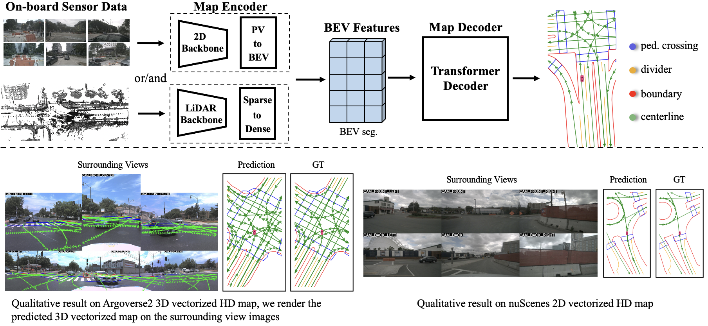

<h1>MapTRV2-FastBEV </h1>

## Introduction

使用fast-ray替换bevpool进行Pv-2-BEV转换

### MapTRv2

<h4> nuScenes dataset</h4>

| Method | Backbone | BEVEncoder |Lr Schd | mAP| Config | Download |
| :---: | :---: | :---: | :---: |  :---: | :---: | :---: |
| MapTRv2 | R50 |bevpool | 24ep | 54.3 |[config](https://github.com/hustvl/MapTR/blob/maptrv2/projects/configs/maptrv2/maptrv2_nusc_r50_24ep_w_centerline.py) |[model](https://drive.google.com/file/d/1m02OKAKPhzMOaSu_4STVcepY8jbE7v3o/view?usp=sharing) / [log](https://drive.google.com/file/d/1cEV7sfiWS0-9Uu1eQEt2xm77l4mAuHMM/view?usp=sharing) |
| MapTRv2 | R50 |FastBEV | 24ep | 46.56|[config](https://github.com/hustvl/MapTR/blob/maptrv2/projects/configs/maptrv2/maptrv2_nusc_r50_24ep_w_centerline_fastbev_single_lvl.py) |[model]() / [log](https://drive.google.com/file/d/1TAvcCLGZw0Cw2pEnfxj1_fg8V-lw4oz6/view?usp=drive_link) |
| MapTRv2 | R50 |FastBEV-Depth | 24ep | 51.8|[config](https://github.com/hustvl/MapTR/blob/maptrv2/projects/configs/maptrv2/maptrv2_nusc_r50_24ep_w_centerline_fastbev/7_lvl_depth_seg_3.py) |[model](https://drive.google.com/file/d/1pi68Y6v1030rlIGMEfNZ92YJ-V1Brox0/view?usp=drive_link) / [log](https://drive.google.com/file/d/1LSvMx36qWeLyhxLyllq0EGWP_iCYbLBU/view?usp=drive_link) |

## Getting Started
- [Installation](docs/install.md)
- [Prepare Dataset](docs/prepare_dataset.md) (Notes: annotation generation of MapTRv2 is different from MapTR )
- [Train and Eval](docs/train_eval.md)
- [Visualization](docs/visualization.md)
